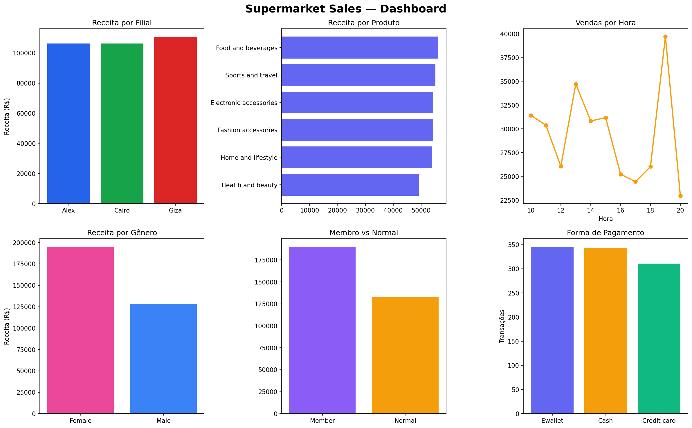

# Supermarket Sales Analysis

Análise exploratória de dados de um supermercado com três filiais, transformando dados transacionais em insights estratégicos.

## Dashboard



## Objetivos

- Análise de desempenho por filial
- Identificação dos produtos mais lucrativos
- Entendimento do comportamento de compra
- Análise de horários de pico
- Perfil de clientes por gênero e tipo

## Principais Insights

- **Filiais equilibradas:** Giza lidera com R$110.568, mas a diferença entre as três filiais é menor que 4% — nenhuma outlier crítica
- **Produto destaque:** Food and beverages lidera em receita e tem a maior avaliação média (7.11)
- **Horário de pico:** 19h é o horário de maior faturamento — oportunidade para promoções direcionadas
- **Perfil feminino:** Clientes do sexo feminino representam 57% das transações e ticket médio 14% maior
- **Fidelidade funciona:** Membros gastam R$29 a mais por visita em média comparado a clientes normais

## Estrutura do Projeto

supermarket-sales-analysis/
├── data/
│   ├── supermarket_raw.csv       # Dados originais
│   ├── supermarket_clean.csv     # Dados após limpeza
│   └── dashboard.png             # Dashboard gerado
├── notebooks/
│   ├── 01_data_cleaning.ipynb    # Limpeza e tratamento
│   ├── 02_eda.ipynb              # Análise exploratória
│   ├── 03_customer_behavior.ipynb # Comportamento do cliente
│   └── 04_dashboard.ipynb        # Dashboard visual
└── README.md

## Tecnologias

- Python 3.14
- pandas
- matplotlib

## Como Executar

```bash
git clone https://github.com/achkiy/supermarket-sales-analysis.git
cd supermarket-sales-analysis
pip install pandas matplotlib openpyxl
```

Abra os notebooks na ordem numérica no VS Code ou Jupyter.

## Dataset

Dataset público disponível no [Kaggle — Supermarket Sales](https://www.kaggle.com/datasets/faresashraf1001/supermarket-sales).
Período: Janeiro a Março de 2019 | 1.000 transações | 3 filiais